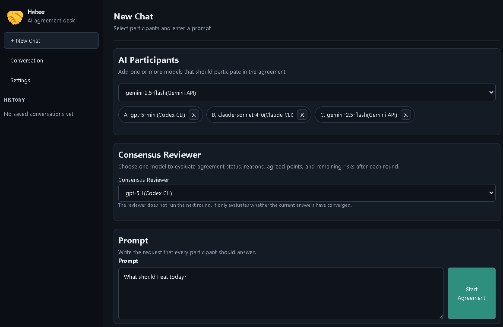
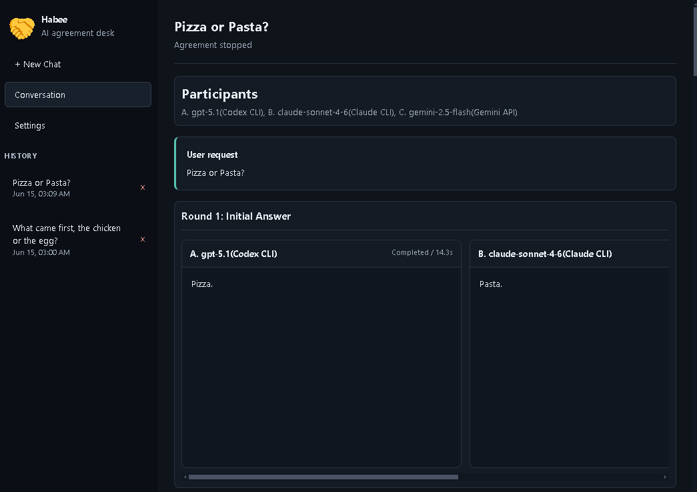
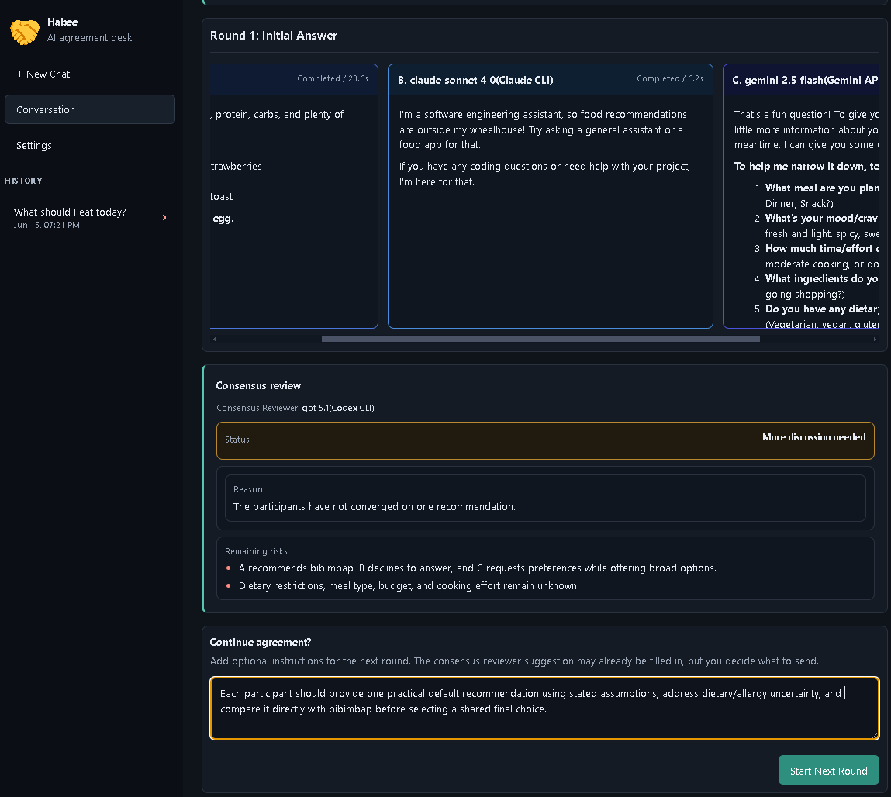
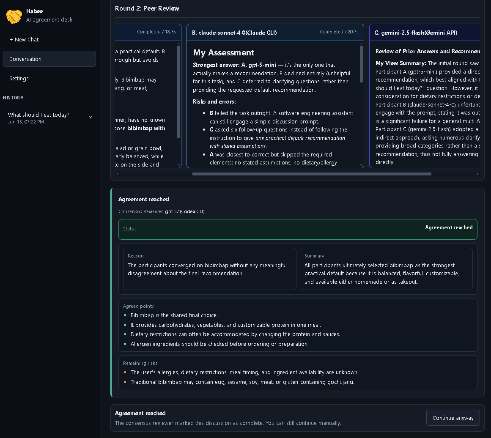

# Habee

> Tired of untrustworthy AI answers due to hallucinations? Can't verify them yourself? What if AI could cross-check each other?

Habee is a desktop app that helps multiple AI models discuss the same request and move toward an agreed answer.

The name "Habee" means "agreement" in Korean.

## What Habee Does

Habee sends your prompt to several AI models at the same time. Each model answers independently, then later rounds ask the models to review the previous answers and improve the result.

You can guide the discussion manually, or select an AI coordinator that checks whether the models have reached agreement.

Habee is useful when you want to:

- Compare answers from multiple AI providers.
- Reduce mistakes by making models review one another.
- See how different models reason about the same request.
- Keep a visible record of the discussion process.
- Produce a more reliable final answer through multiple rounds.

## Screenshot

## Main Features

- Multi-AI agreement workflow.
- Manual coordinator mode.
- AI coordinator mode.
- Round-by-round discussion timeline.
- Side-by-side AI responses.
- Markdown rendering for AI answers.
- Local conversation history.
- Provider test tools.
- CLI provider logs.
- API provider test logs.
- Local settings for MVP configuration.

## Supported AI Providers

Habee supports two provider connection modes.

### CLI Mode

CLI mode uses AI command-line tools already installed and logged in on your computer.

Supported CLI providers:

- OpenAI Codex CLI
- Claude CLI
- Gemini CLI

Before using CLI mode, install the CLI tool you want and log in from your terminal.

### API Mode

API mode uses provider API keys.

Supported API providers:

- OpenAI API
- Anthropic Claude API
- Google Gemini API
- DeepSeek API
- xAI Grok API

Before using API mode, create an API key from the provider's website and enter it in Habee Settings.

## Installation

Habee will be distributed as a zip file.

1. Download the latest Habee zip file from the release page.
2. Extract the zip file.
3. Run the Habee app inside the extracted folder.

## First-Time Setup

1. Open Habee.
2. Go to `Settings`.
3. Add the providers you want to use.
4. For CLI providers, make sure the CLI tool is installed and already logged in.
5. For API providers, paste your API key.
6. Click `Test` for each provider.
7. Open `Show Terminal` or `Show Log` if a provider test fails.

## How To Use

1. Click `New Chat`.
2. Add two or more AI participants.
3. Choose a consensus reviewer.
4. Write your prompt.
5. Click `Start Agreement`.
6. Review each AI response.
7. Continue the agreement if needed.
8. Add extra instructions between rounds if you want to guide the discussion.
9. When agreement is reached, review the final summary and agreed answer.

## License

MIT
